# DiSE
A DIY speed editor to use with video editing sw such as Davinci Resolve and others  
  
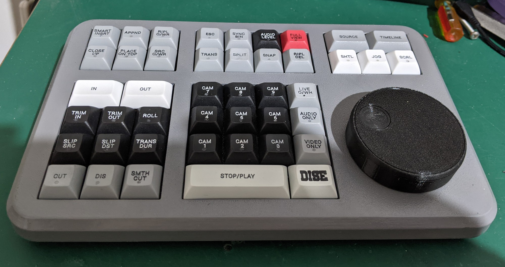

## Bill Of Materials:
- 1 [Bluepill Processor Board](#processor-module) 
- 1 [100ppr 5v Encoder](#encoder) 
- 44 [Cherry MX Keys and Sockets](#cherry-keys)
- 44 [Different sized Key Caps](#key-caps)
    -  DSA22 1u 18pc (18 x 1u)  
    -  DSA17 1u 18pc (18 x 1u)  
    -  DSA19 1u 4pc (4 x 1u)  
    -  DSA1 1u 3pc (3 x 1u)  
    -  DSA22 1.5u 2pc (4 x 1u)  
    -  DSA19 1.5u 2pc (4 x 1u)  
    -  DSA21 2u 2pc (4 x 1u)  
    -  DSA21 1.25u 1pc (2 x 1u)  
    -  DSA21 2.75u 1pc (3 x 1u)  
- 44 [3mm LEDs](#leds)  
- 1 [USB-C Connector](#usbc-connector)
- 18 [0603 Resistors (2x1k, 7x330R, 7x68R)](#resistors)
- 1 [small schottky diode](#diode)
- (Optional) [Encoder Connector](#connector)
- Access to a 3d Printer to print the case and knob under the mechanics folder.

### Processor Module:
Beware there are out there many STM32103 Clones under the blue pill name. Some Clones may not perform as the original STM32 processor. [More info](https://hackaday.com/2020/10/22/stm32-clones-the-good-the-bad-and-the-ugly/).
Definitely STM Software Utillities try hard to identify their own branded original chipsets and wont work on any other detectable clone. Wich makes debugging and developping very difficult.

#### **Recommended** 
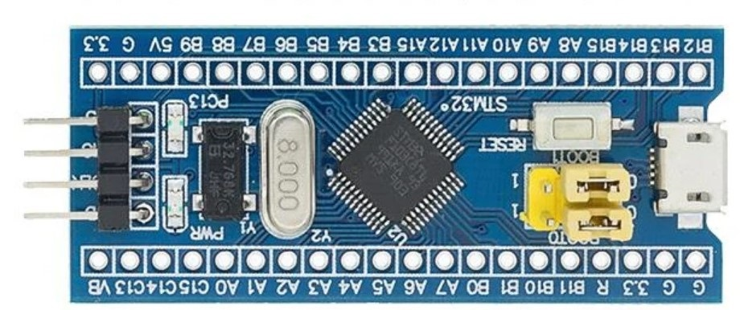

Blue-Pill with original STM32 Processor module: https://www.aliexpress.com/item/1766455290.html 
(order both STM32F103C8T6 and ST-Link V2 programmer)

#### **Cheaper Alternative** 
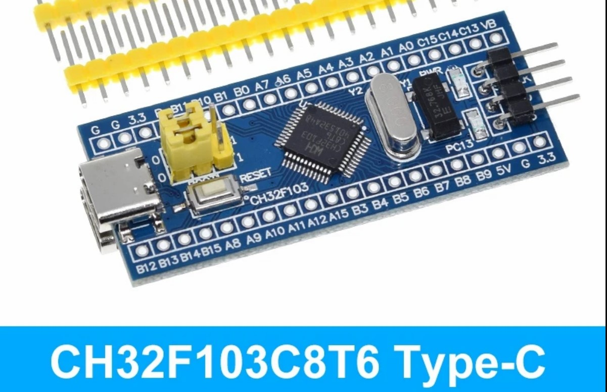

Blue-Pill with CH32F103C8T6 and two usb Ports. No need of ST-Link programmer. One USB-C port is used to download/upgrade the firmware using wch programming software. Can also be programmed with an ST-Link dongle and the old ST-Link004 from STM.
(Proved to work, cheaper, not compatible with newer STM Tools thought, only 64k, so not recomended for developping )

### Encoder
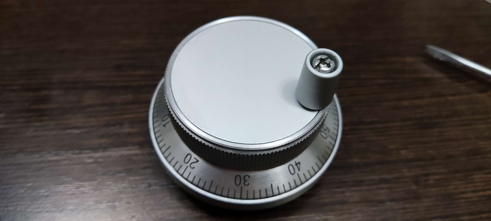
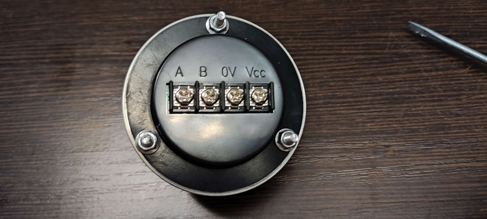

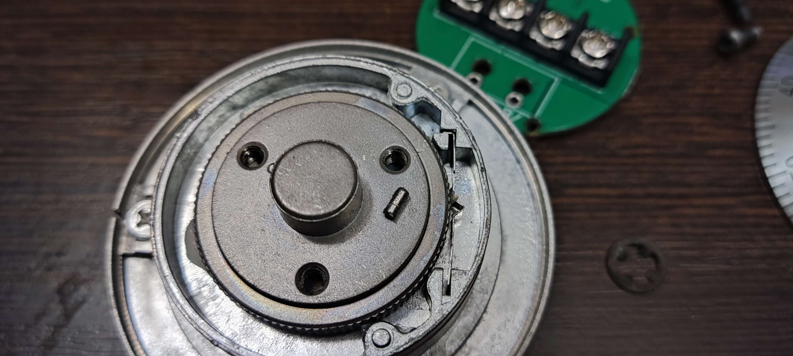

**Optical Encoder 100ppr 5v 4pin 60mm** 
We will be modifying the top part to remove the bearing pin that acts as a clicker to let it run quieter and smoothly. 
The pin can be reached by removing the spindle handler screw, then remove the upper plate that it is glued to uncover the three screws that holds the knob in place, and after removing it dissasemble the support plate that holds the spring in place.
The pin can be taken from its place and saved safely for any future reassembly in the little space behind the spring.

Encoder: https://www.aliexpress.com/item/4000897699294.html 1 unit  

### Cherry Keys
Cherry MX Keys and Sockets

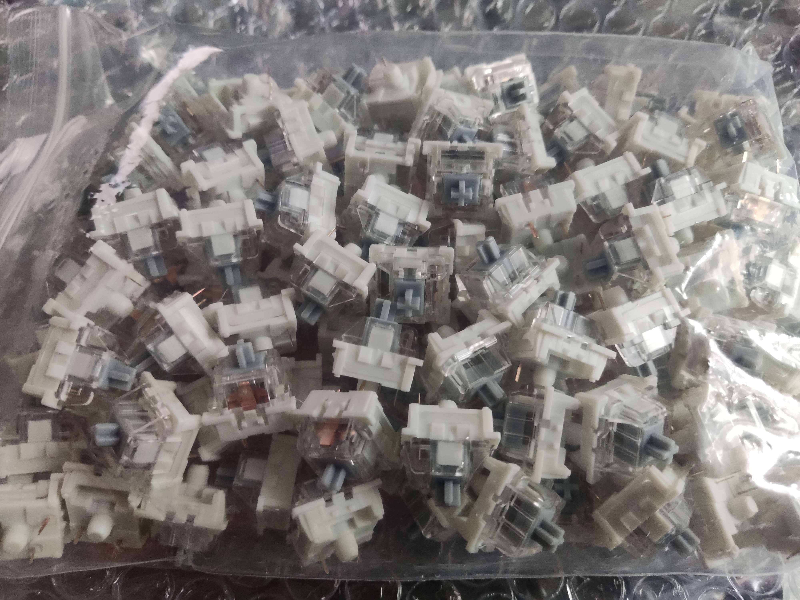

Keys: https://www.aliexpress.com/item/1005002378701948.html Order Silent Gray type 44pcs (order 2 packs of 30)  

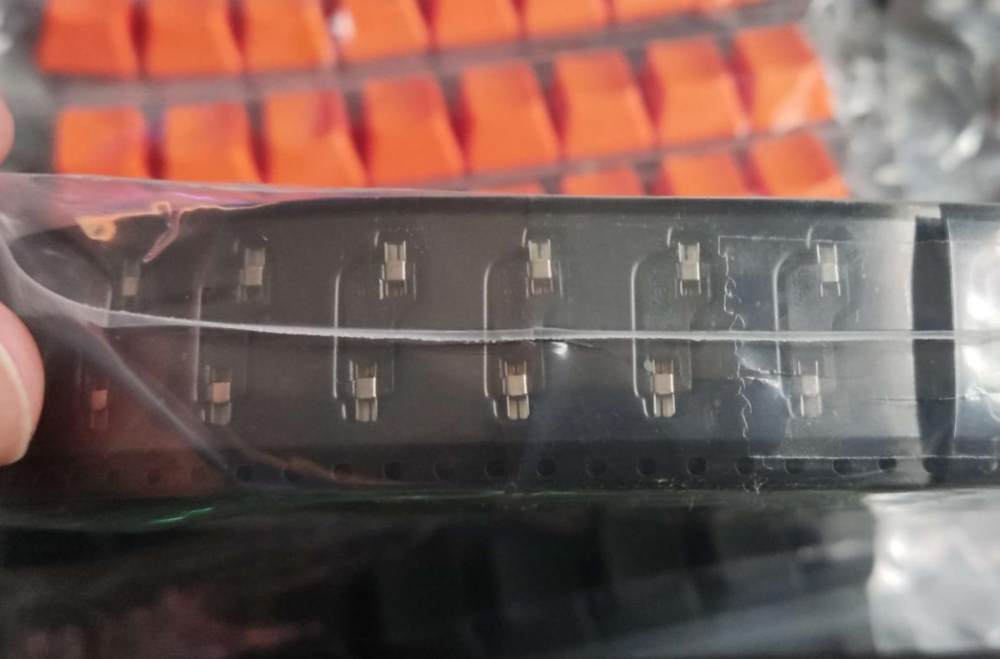

Key Sockets: https://www.aliexpress.com/item/4001051840976.html 44pcs (order 50 pcs ) 

### Key Caps
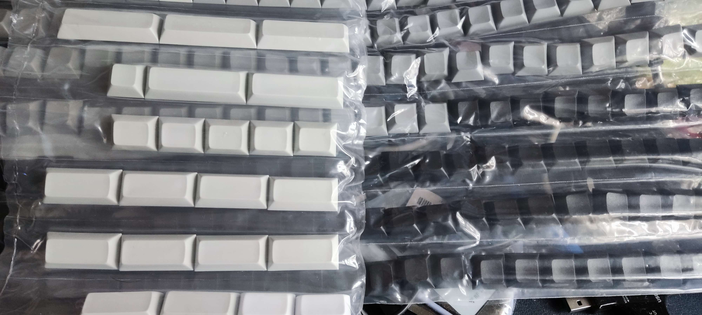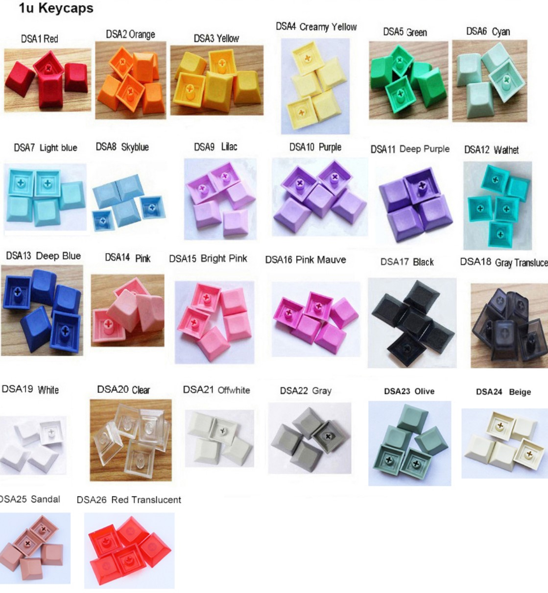

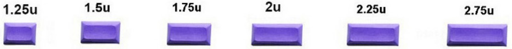

Key Caps: https://www.aliexpress.com/item/32850729893.html 44pcs (Order 60 pcs, and send the list below):  
-  DSA22 1u 18pc (18 x 1u)  (Gray)
-  DSA17 1u 18pc (18 x 1u)  (Black)
-  DSA19 1u 4pc (4 x 1u)    (White)
-  DSA1 1u 3pc (3 x 1u)     (Red)
-  DSA22 1.5u 2pc (4 x 1u)  (Gray)
-  DSA19 1.5u 2pc (4 x 1u)  (White)
-  DSA21 2u 2pc (4 x 1u)    (OffWhite)
-  DSA21 1.25u 1pc (2 x 1u) (OffWhite)
-  DSA21 2.75u 1pc (3 x 1u) (OffWhite)

This list will match the colors shown on the example picture showed above. 
Printing the layout text on the keycaps can be done using thermal sublimation ink, or laser printed.

**Beware** that if you don't have access to a printer with white thermal sublimation ink printing on the black keycaps (DSA17) can be challenging. You may want to change those to another color from the upper color table so you can transfer your layout text using common black toner for laser printers, or dark transfer ink.

Those samples were printed using whiteboard markers and a L1 laserpecker:

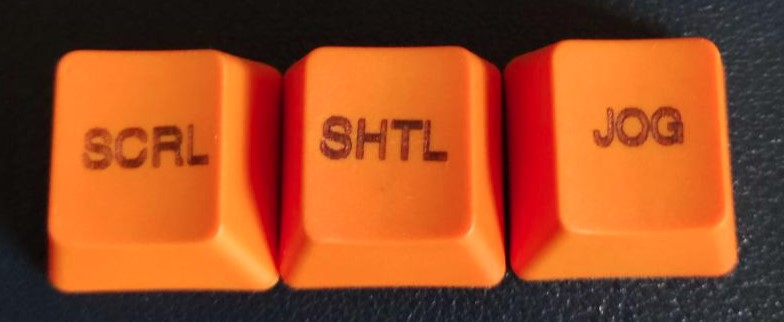

This sample was lasered with a laserpecker and then filled the gap with paint. (extremely difficult to get it right)

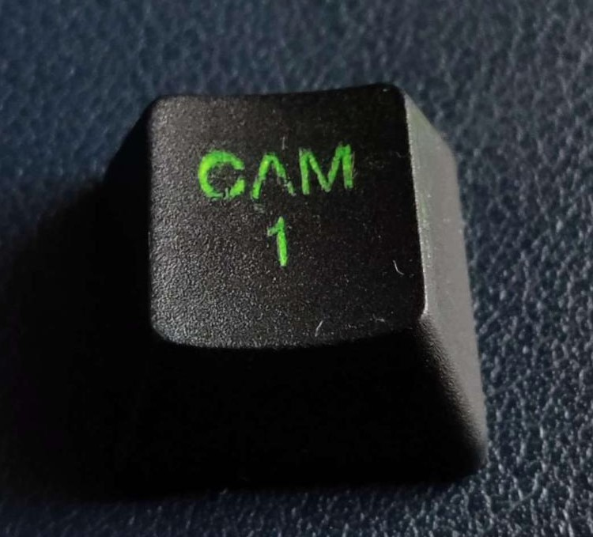

Check the assembly instructions to know more about how to DIY the keycap printing.

### LEDs 
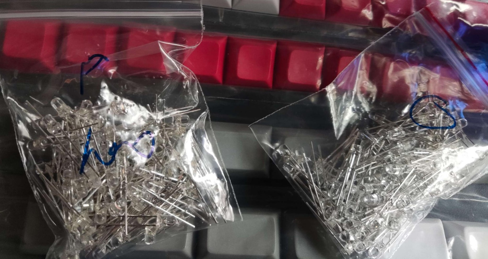

Standard 3mm LEDs. Any color. 
https://www.aliexpress.com/item/32685518028.html or any 3mm led, any color  44pcs

### USBC Connector
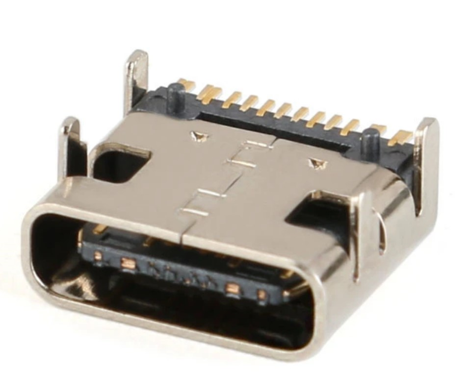

If you chose the path of using the CH32 board, there is already a working connector you can use. Should that be the case, usbc cable can be plugged from right side. This breaked out connector is to move that to the center top.
If you chose the bluepill with only one usb connector (micro USB) there is no way around soldering this connector.

USB C connector: https://www.aliexpress.com/item/32976750426.html  

### Resistors 
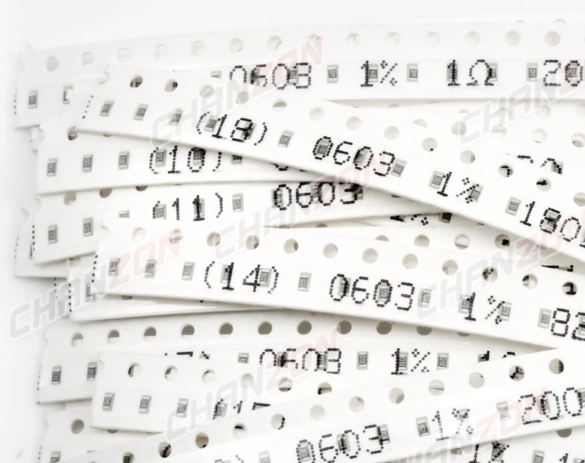

0603 resistor kit: https://www.aliexpress.com/item/1005002364437129.html . Usage:
- R1 - R7 : 330 ohm (7pcs)
- R10 - R11 : 22 ohm (2pcs)
- R8 - R9 : 1K ohm (2pcs)
- R43 - R51: 68 ohm (7pcs)

If you struggle to find a kit that has the 68ohm value, 62ohm will work as well.

### Diode
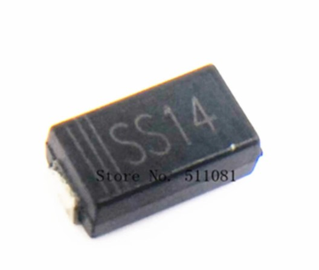

A small schottky diode. A 1N5819 SS14 SMD will work. 
1pc Needed, But its cheaper to get 100 than only one. https://www.aliexpress.com/item/627622453.html

### Connector
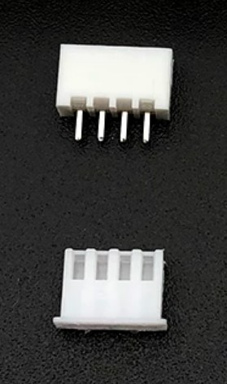 

Optional 4pin pcb connector for the encoder. You may just skip this and solder the wires direct to the pcb

https://www.aliexpress.com/item/4000126563819.html

### Instructions 
TBD

